# WebSocket Implementation for Party Sessions

This document describes the WebSocket implementation used for real-time party session synchronization in Boardsesh. Party mode allows multiple climbers to collaborate on a shared queue of climbs, with real-time synchronization across all connected clients.

## Table of Contents

1. [Architecture Overview](#architecture-overview)
2. [Technology Stack](#technology-stack)
3. [Connection Flow](#connection-flow)
4. [Session Management](#session-management)
5. [Queue State Synchronization](#queue-state-synchronization)
6. [Multi-Instance Support](#multi-instance-support)
7. [Failure States and Recovery](#failure-states-and-recovery)
8. [Data Persistence Strategy](#data-persistence-strategy)

---

## Architecture Overview

The party session system uses a GraphQL-over-WebSocket architecture with the following key components:

```
┌─────────────────────────────────────────────────────────────────────────┐
│                              Frontend (Next.js)                          │
├─────────────────────────────────────────────────────────────────────────┤
│  ┌─────────────────────┐    ┌─────────────────────────────────────────┐ │
│  │ PersistentSession   │◄───┤ GraphQL Client (graphql-ws)             │ │
│  │ Context             │    │ - Connection management                  │ │
│  └─────────┬───────────┘    │ - Subscription handling                  │ │
│            │                │ - Reconnection with exponential backoff  │ │
│  ┌─────────▼───────────┐    └─────────────────────────────────────────┘ │
│  │ QueueContext        │                                                 │
│  │ - Local state       │                                                 │
│  │ - Optimistic updates│                                                 │
│  └─────────────────────┘                                                 │
└─────────────────────────────────────────────────────────────────────────┘
                                    │
                                    │ WebSocket (graphql-ws protocol)
                                    ▼
┌─────────────────────────────────────────────────────────────────────────┐
│                           Backend (Node.js)                              │
├─────────────────────────────────────────────────────────────────────────┤
│  ┌─────────────────────┐    ┌─────────────────────┐                     │
│  │ WebSocket Server    │    │ GraphQL Yoga        │                     │
│  │ (graphql-ws)        │◄───┤ - Schema            │                     │
│  │ - Auth validation   │    │ - Resolvers         │                     │
│  │ - Connection mgmt   │    └─────────────────────┘                     │
│  └─────────┬───────────┘                                                 │
│            │                                                             │
│  ┌─────────▼───────────┐    ┌─────────────────────┐                     │
│  │ RoomManager         │◄───┤ PubSub              │                     │
│  │ - Session state     │    │ - Local dispatch    │                     │
│  │ - Client tracking   │    │ - Redis pub/sub     │                     │
│  └─────────┬───────────┘    └─────────────────────┘                     │
│            │                                                             │
│  ┌─────────▼─────────────────────────────────────────────────────────┐  │
│  │ DistributedStateManager (multi-instance support)                   │  │
│  │ - Cross-instance connection tracking                               │  │
│  │ - Distributed leader election (Lua scripts)                        │  │
│  │ - Session membership across instances                              │  │
│  │ - Instance heartbeating & cleanup                                  │  │
│  └─────────┬─────────────────────────────────────────────────────────┘  │
│            │                                                             │
│  ┌─────────▼───────────┐    ┌─────────────────────┐                     │
│  │ RedisSessionStore   │    │ PostgreSQL          │                     │
│  │ - Hot cache (4h TTL)│    │ - Persistent storage│                     │
│  │ - User presence     │    │ - Session history   │                     │
│  │ - Distributed locks │    │ - Queue state       │                     │
│  └─────────────────────┘    └─────────────────────┘                     │
└─────────────────────────────────────────────────────────────────────────┘
```

## Technology Stack

| Component | Technology | Purpose |
|-----------|------------|---------|
| WebSocket Protocol | `graphql-ws` | GraphQL subscriptions over WebSocket |
| Backend Framework | GraphQL Yoga | HTTP + WS GraphQL server |
| Frontend Client | `graphql-ws` client | Connection management |
| Pub/Sub | Redis | Multi-instance event distribution |
| Hot Cache | Redis | Real-time session state (4h TTL) |
| Persistent Storage | PostgreSQL | Durable session & queue history |

---

## Connection Flow

### Initial Connection Sequence

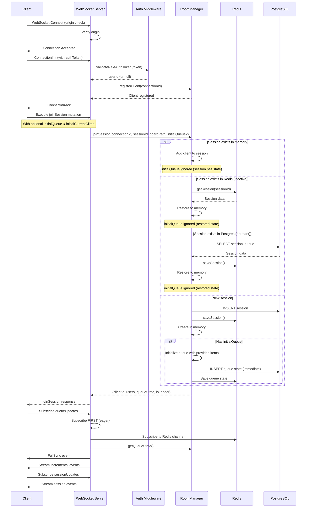

### Key Points

1. **Origin Validation**: WebSocket connections are validated against allowed origins
2. **Authentication**: Optional auth token passed in `connectionParams`
3. **Eager Subscription**: Queue subscription starts BEFORE fetching state to prevent race conditions
4. **Session Restoration**: Sessions can be restored from Redis (hot) or PostgreSQL (cold)
5. **Initial Queue Seeding**: When creating a new session, clients can provide `initialQueue` and `initialCurrentClimb` to seed the session with an existing local queue (e.g., when starting party mode with climbs already queued)

### Initial Queue Seeding

When a user starts party mode while they already have climbs in their local queue, the client sends the existing queue along with the `joinSession` mutation. This ensures users don't lose their queued climbs when transitioning to party mode.

**GraphQL Mutation Parameters:**
```graphql
mutation JoinSession(
  $sessionId: ID!
  $boardPath: String!
  $username: String
  $avatarUrl: String
  $initialQueue: [ClimbQueueItemInput!]    # Optional: existing queue items
  $initialCurrentClimb: ClimbQueueItemInput # Optional: current climb
  $sessionName: String                      # Optional: display name for the session
) {
  joinSession(
    sessionId: $sessionId
    boardPath: $boardPath
    username: $username
    avatarUrl: $avatarUrl
    initialQueue: $initialQueue
    initialCurrentClimb: $initialCurrentClimb
    sessionName: $sessionName
  ) { ... }
}
```

**Behavior:**
- `initialQueue`, `initialCurrentClimb`, and `sessionName` are **only applied when creating a new session**
- If joining an existing session (active, inactive, or dormant), these values are ignored and the existing session state is used
- The queue is persisted immediately to Postgres (not debounced) to ensure durability for new sessions
- All users who join after the initial seed will receive the seeded queue state

**Client Flow (PersistentSessionContext):**
1. User calls `startSession()` which generates a new session ID
2. Client stores current queue in `pendingInitialQueue` via `setInitialQueueForSession()`
3. On WebSocket connection, the `joinSession` mutation includes the initial queue data
4. Server initializes the new session with the provided queue items
5. Client clears `pendingInitialQueue` after successful join

### Session Path Continuity

The WebSocket connection should remain stable when users navigate within the same board configuration. This is controlled by the **base board path** concept.

**URL Structure:**
```
/{board}/{layout}/{size}/{sets}/{angle}/{view}/{climb}
  │       │        │      │      │       │       │
  └───────┴────────┴──────┴──────┴───────┴───────┴──── Dynamic segments
  │       │        │      │      │
  └───────┴────────┴──────┴──────┴──────────────────── Base board path (session identity)
```

**What triggers session reconnection:**
| Change Type | Reconnects? | Reason |
|-------------|-------------|--------|
| Different board (kilter vs tension) | ✅ Yes | Different physical board |
| Different layout | ✅ Yes | Different hold arrangement |
| Different size | ✅ Yes | Different board dimensions |
| Different sets | ✅ Yes | Different hold selection |
| Different angle | ❌ No | Board angle is adjustable during session |
| Different view (/list, /play, /create) | ❌ No | Just navigation state |
| Different climb (in /play view) | ❌ No | Just viewing different climb |

**Implementation:**
The `getBaseBoardPath()` utility in `url-utils.ts` extracts the stable board configuration path by stripping:
- `/play/[climb_uuid]` - climb being viewed
- `/view/[climb_slug]` - climb detail view
- `/list`, `/create` - view type
- `/{angle}` - board angle (numeric segment at end)

This ensures `BoardSessionBridge` only calls `activateSession()` when the actual board configuration changes, not when users swipe between climbs or adjust the board angle.

---

## Session Management

### Session Lifecycle States

```
                    ┌─────────────┐
                    │   Created   │
                    └──────┬──────┘
                           │ First user joins
                           ▼
    ┌──────────────────────────────────────────────┐
    │                   ACTIVE                      │
    │  - Users connected                            │
    │  - Real-time sync enabled                     │
    │  - Redis cache hot                            │
    └──────────────────────────┬───────────────────┘
                               │ Last user leaves
                               ▼
    ┌──────────────────────────────────────────────┐
    │                  INACTIVE                     │
    │  - No connected users                         │
    │  - Redis cache retained (4h TTL)              │
    │  - Can be restored                            │
    └──────────────────────────┬───────────────────┘
                               │ TTL expires OR explicit end
                               ▼
    ┌──────────────────────────────────────────────┐
    │                   ENDED                       │
    │  - Removed from Redis                         │
    │  - Postgres record kept for history           │
    │  - Cannot be rejoined                         │
    └──────────────────────────────────────────────┘
```

### Leader Election

Leader election uses Redis-backed atomic operations for consistency across instances:

**Single Instance Mode:**
- First client to join becomes leader
- On leader disconnect, earliest connected client is elected

**Multi-Instance Mode (Distributed):**
- Uses Lua scripts for atomic leader election
- Leader stored in Redis: `boardsesh:session:{id}:leader`
- Consistent across all backend instances

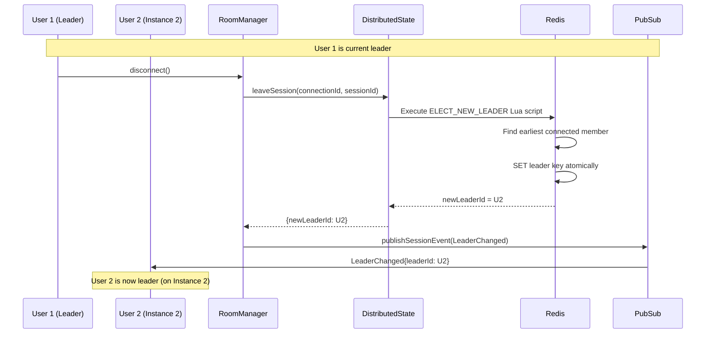

**Lua Script Atomicity:**
```lua
-- ELECT_NEW_LEADER_SCRIPT
-- Gets all session members, filters out leaving connection
-- Sorts by connectedAt, picks earliest
-- Atomically sets new leader
```

---

## Queue State Synchronization

### Event Types

| Event | Description | Fields |
|-------|-------------|--------|
| `FullSync` | Complete state snapshot | `sequence`, `state` (queue + currentClimb) |
| `QueueItemAdded` | Item added to queue | `sequence`, `item`, `position` |
| `QueueItemRemoved` | Item removed from queue | `sequence`, `uuid` |
| `QueueReordered` | Item moved in queue | `sequence`, `uuid`, `oldIndex`, `newIndex` |
| `CurrentClimbChanged` | Active climb changed | `sequence`, `item`, `clientId`, `correlationId` |
| `ClimbMirrored` | Mirror state toggled | `sequence`, `mirrored` |

### Optimistic Updates with Correlation IDs

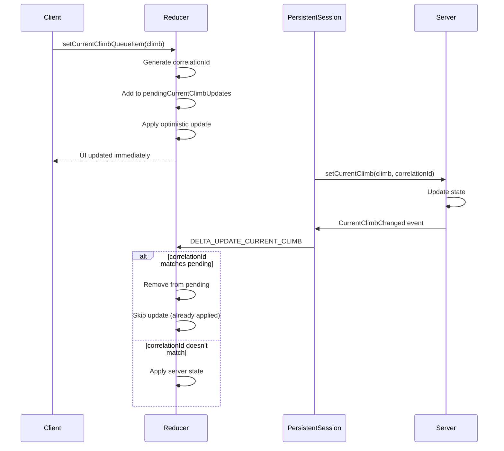

### Sequence Gap Detection

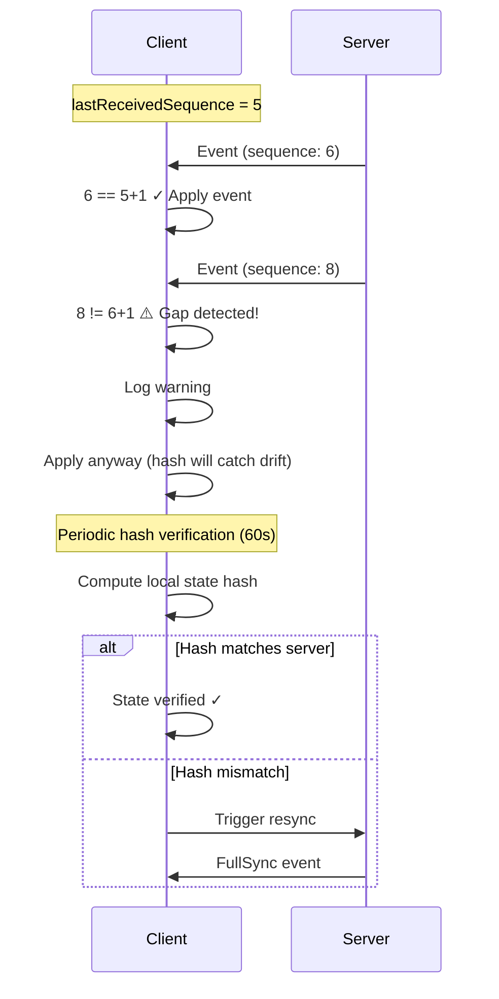

---

## Multi-Instance Support

The backend supports horizontal scaling with multiple instances behind a load balancer. **No sticky sessions are required** - any instance can handle any client.

### Architecture

```
┌─────────────────────────────────────────────────────────────────┐
│                        Load Balancer                             │
│              (No sticky sessions required)                       │
└─────────────────────────────────────────────────────────────────┘
           │                    │                    │
    ┌──────▼───────┐    ┌──────▼───────┐    ┌──────▼───────┐
    │  Instance A  │    │  Instance B  │    │  Instance C  │
    │              │    │              │    │              │
    │ DistState ───┼────┼──────────────┼────┼─── Redis ◄──┤
    │  Manager     │    │              │    │              │
    └──────────────┘    └──────────────┘    └──────────────┘
```

### DistributedStateManager

The `DistributedStateManager` enables true horizontal scaling:

| Feature | Description |
|---------|-------------|
| Connection Tracking | All connections visible across instances via Redis |
| Session Membership | Aggregated user list from all instances |
| Leader Election | Atomic Lua scripts ensure consistent leader |
| Instance Heartbeat | 30s heartbeat detects dead instances |
| Graceful Cleanup | Connections cleaned up on instance shutdown |

### Redis Pub/Sub for Cross-Instance Events

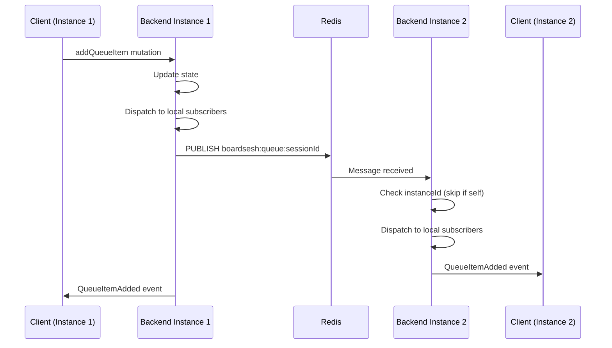

### Cross-Instance Session Membership Validation

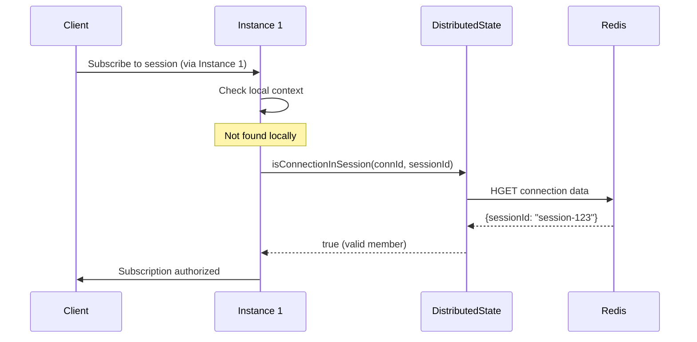

### Channel Naming Convention

- Queue events: `boardsesh:queue:{sessionId}`
- Session events: `boardsesh:session:{sessionId}`

### Event Buffer for Delta Sync

Events are buffered in Redis for reconnection recovery:

```
boardsesh:session:{sessionId}:events
├── Most recent event (index 0)
├── ...
└── Oldest event (max 100 events, 5 min TTL)
```

---

## Failure States and Recovery

### 1. Client Disconnection

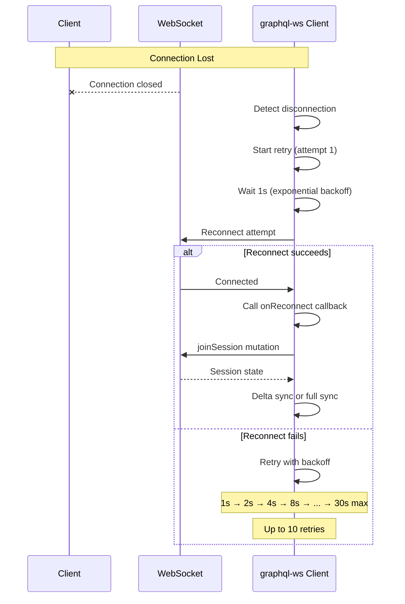

**Recovery mechanism:**
- Exponential backoff: 1s, 2s, 4s, 8s, 16s, 30s (max)
- Up to 10 retry attempts
- On reconnection: re-join session and sync state
- Delta sync attempted if gap ≤ 100 events
- Falls back to full sync if gap too large

### 2. Redis Connection Failure

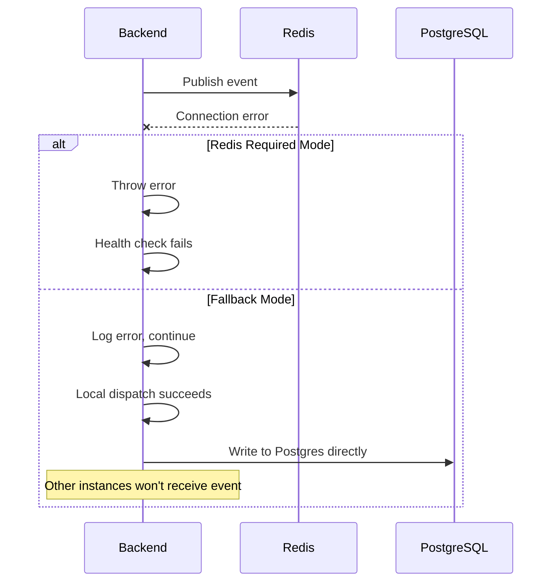

**Key behavior:**
- If `REDIS_URL` is configured, Redis is **required** (fail-closed)
- Without Redis config: local-only mode (single instance)
- Publish failures logged but don't block local dispatch
- Health endpoint reports Redis status

### 3. PostgreSQL Write Failure

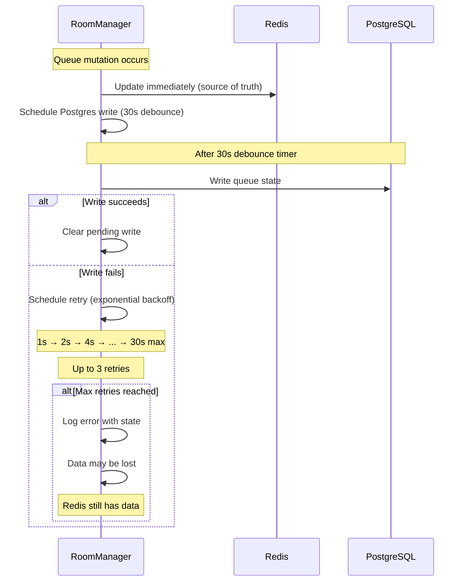

**Mitigation:**
- Redis is the real-time source of truth
- Postgres writes are debounced (30s) and retried
- Graceful shutdown flushes all pending writes
- Session can be recovered from Redis (4h TTL)

### 4. Session Restoration Race Condition

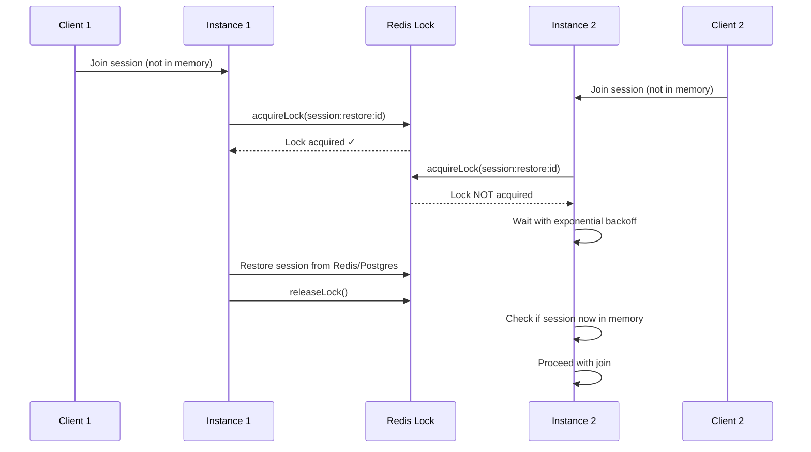

**Lock mechanism:**
- Redis-based distributed lock (10s TTL)
- Lua script ensures only owner can release
- Backoff waiting: 50ms → 100ms → 200ms → ... (5 attempts)

### 5. State Hash Mismatch (Drift Detection)

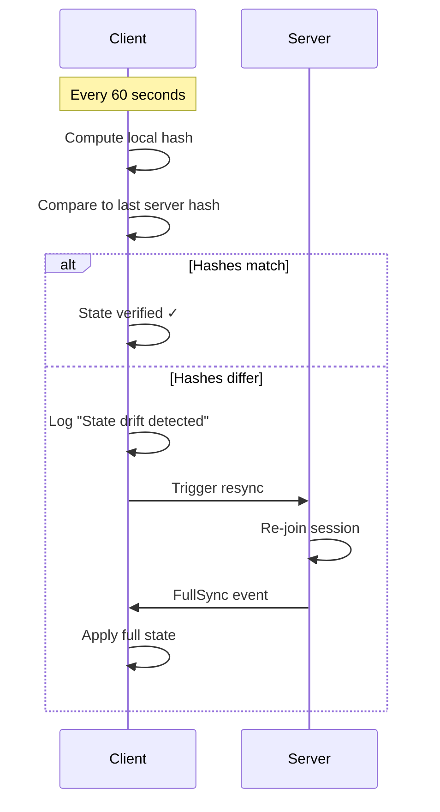

**Additional checks:**
- Current climb must exist in queue
- Sequence numbers must increment by 1
- Hash updated after each delta event

### 6. Queue Item Corruption Detection

The client detects and recovers from corrupted queue items (null/undefined entries) that may occur due to server bugs, network issues, or state corruption.

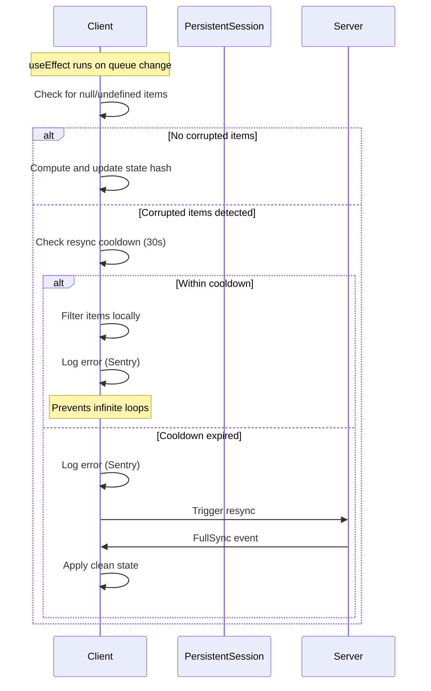

**Corruption sources:**
- Server sends malformed queue data
- State corruption during delta sync
- Race conditions in event handling

**Detection points:**
1. **FullSync handler**: Filters null items when receiving initial/full state
2. **QueueItemAdded handler**: Skips events with null items
3. **State hash effect**: Detects corruption in current queue state

**Resync cooldown:**
- 30 second cooldown between corruption-triggered resyncs
- Prevents infinite loop if server keeps returning corrupted data
- During cooldown: filter corrupted items locally instead of resyncing
- All corruption events logged at `console.error` level for Sentry visibility

**Implementation:**
- `computeQueueStateHash()` defensively filters null/undefined items
- `isFilteringCorruptedItemsRef` prevents useEffect re-trigger loops
- `lastCorruptionResyncRef` tracks cooldown timing

### 7. Subscription Error / Complete

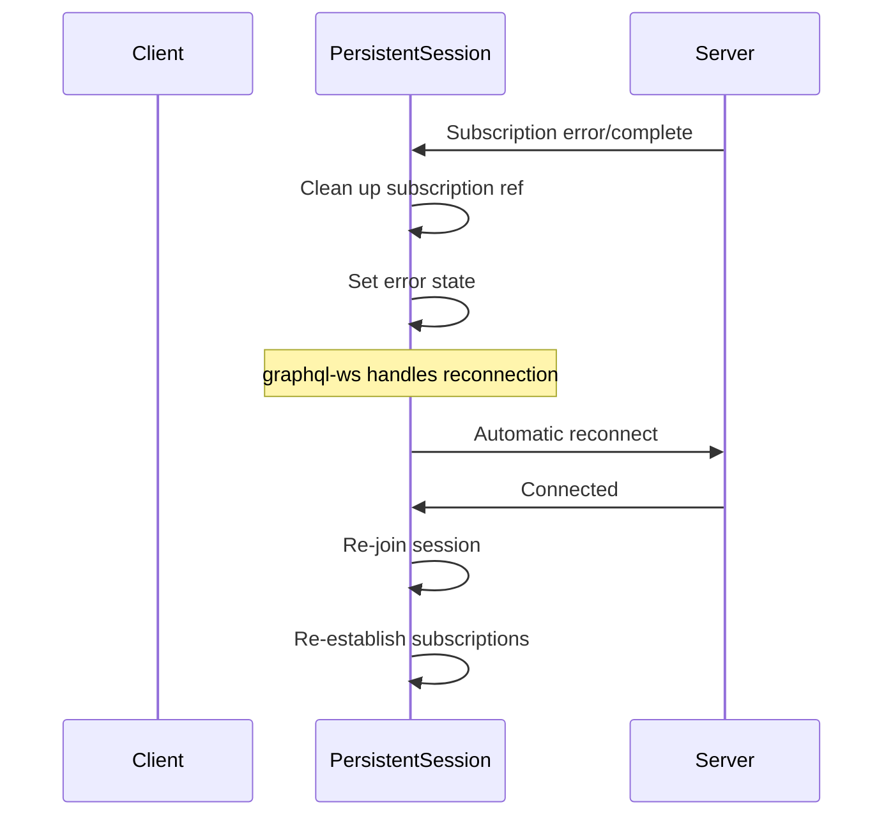

---

## Data Persistence Strategy

### Hybrid Storage Architecture

```
┌─────────────────────────────────────────────────────────────────┐
│                         Write Path                               │
├─────────────────────────────────────────────────────────────────┤
│                                                                  │
│   Queue Mutation ──────► Redis (immediate)                       │
│         │                                                        │
│         └──────────────► Postgres (30s debounced)                │
│                                                                  │
└─────────────────────────────────────────────────────────────────┘

┌─────────────────────────────────────────────────────────────────┐
│                         Read Path                                │
├─────────────────────────────────────────────────────────────────┤
│                                                                  │
│   Get State ──► Redis (hot cache) ──► Postgres (cold storage)   │
│                      │                       │                   │
│                      ▼                       ▼                   │
│                 Active sessions         Dormant sessions         │
│                 (< 4 hours)             (> 4 hours)              │
│                                                                  │
└─────────────────────────────────────────────────────────────────┘
```

### Session State Tiers

| Tier | Storage | TTL | Use Case |
|------|---------|-----|----------|
| **Hot** | In-Memory + Redis | 4 hours | Active sessions with connected users |
| **Warm** | Redis only | 4 hours | Recently inactive (users left) |
| **Cold** | PostgreSQL | Indefinite | Historical sessions, dormant restoration |

### Key Redis Data Structures

**Session State (RedisSessionStore):**
```
boardsesh:session:{id}              # Hash - session data (queue, version, etc.)
boardsesh:session:{id}:users        # Hash - connected users (legacy)
boardsesh:session:{id}:events       # List - event buffer (delta sync)
boardsesh:session:active            # Set - active session IDs
boardsesh:session:recent            # Sorted Set - recent sessions (by time)
boardsesh:lock:session:restore:{id} # String - distributed lock (10s TTL)
```

**Distributed State (DistributedStateManager):**
```
boardsesh:conn:{connectionId}       # Hash - connection data (instanceId, sessionId, username, etc.)
boardsesh:session:{id}:members      # Set - connection IDs in session (cross-instance)
boardsesh:session:{id}:leader       # String - leader connection ID
boardsesh:instance:{id}:conns       # Set - connections owned by instance
boardsesh:instance:{id}:heartbeat   # String - instance heartbeat timestamp (60s TTL)
```

**Pub/Sub Channels:**
```
boardsesh:queue:{sessionId}         # Queue events (add, remove, reorder, etc.)
boardsesh:session:{sessionId}       # Session events (join, leave, leader change)
```

### Graceful Shutdown

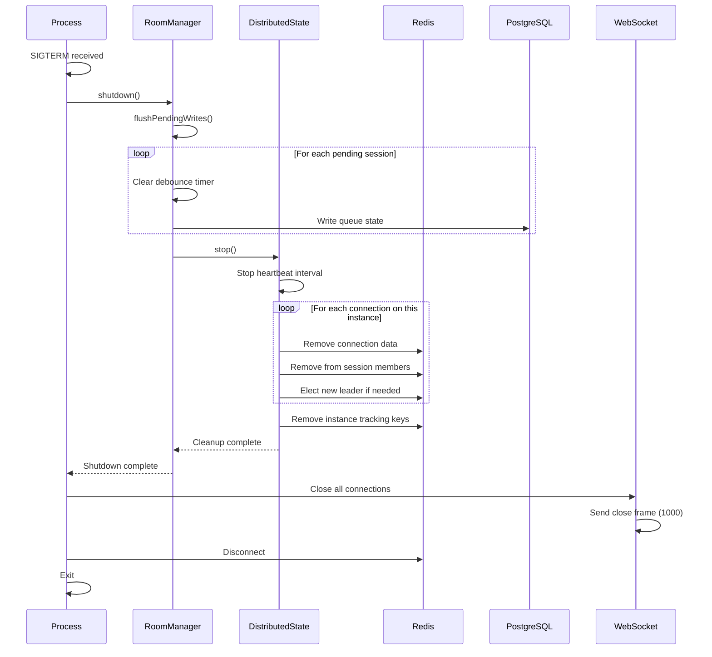

### Dead Instance Detection and TTL Cleanup

When an instance crashes or terminates without graceful shutdown, the system relies on TTL-based cleanup:

**1. Instance Heartbeat Expiry (60s TTL)**

Each instance updates its heartbeat every 30 seconds:
```
boardsesh:instance:{id}:heartbeat = timestamp (60s TTL)
```

When an instance dies unexpectedly:
- The heartbeat key expires after 60 seconds
- Redis automatically removes the heartbeat key

**2. Connection Data Expiry (1 hour TTL)**

Connection data has its own TTL:
```
boardsesh:conn:{connectionId} = {...} (1 hour TTL)
```

Connections from dead instances:
- Continue to exist until their 1-hour TTL expires
- Are refreshed on client activity (extends TTL)
- Eventually expire if no activity

**3. Session Member Sets (4 hour TTL)**

Session member sets track all connection IDs:
```
boardsesh:session:{id}:members = Set of connectionIds (4 hour TTL)
```

**Limitation: No Active Cleanup for Dead Instances**

Currently, there is no background job that actively scans for dead instances and cleans up their orphaned connections. This means:

- Session member sets may temporarily contain connection IDs from dead instances
- `getSessionMembers()` may return connections that no longer exist (gracefully handled by filtering out missing connection data)
- Leader election may initially select a connection from a dead instance (but will re-elect on next leader action)
- Connection data remains until TTL expires naturally

**Implications for Clients**

- Clients should handle the case where a session "member" is no longer reachable
- Leader changes may occur when the elected leader from a dead instance is detected as unresponsive
- User lists may temporarily show stale entries that get filtered out on refresh

**Future Improvement**

A background cleanup job could periodically:
1. Scan for instances with expired heartbeats
2. Remove their orphaned connections from session member sets
3. Trigger leader re-election if the current leader's instance is dead

This would reduce the window of stale data but is not currently implemented.

---

## Configuration

### Environment Variables

| Variable | Description | Default |
|----------|-------------|---------|
| `REDIS_URL` | Redis connection string | None (local-only mode) |
| `PORT` | HTTP/WS server port | 8080 |
| `BOARDSESH_URL` | Allowed CORS origin | https://boardsesh.com |

### Timeouts and Limits

| Setting | Value | Purpose |
|---------|-------|---------|
| Retry attempts | 10 | WebSocket reconnection |
| Max retry delay | 30s | Exponential backoff cap |
| Keep-alive interval | 10s | Connection health check |
| Mutation timeout | 30s | Prevent hanging mutations |
| Redis TTL | 4 hours | Session cache expiry |
| Postgres debounce | 30s | Batch writes |
| Event buffer size | 100 | Delta sync limit |
| Event buffer TTL | 5 min | Old events cleanup |
| Hash verification | 60s | State drift detection |
| Subscription queue | 1000 | Max pending events |
| Connection TTL | 1 hour | Distributed connection expiry |
| Instance heartbeat | 30s | Heartbeat update interval |
| Instance heartbeat TTL | 60s | Dead instance detection |
| Session members TTL | 4 hours | Matches session TTL |

---

## Related Files

### Backend

- `packages/backend/src/websocket/setup.ts` - WebSocket server configuration
- `packages/backend/src/pubsub/index.ts` - Event pub/sub system
- `packages/backend/src/pubsub/redis-adapter.ts` - Redis pub/sub adapter
- `packages/backend/src/services/room-manager.ts` - Session & queue management
- `packages/backend/src/services/redis-session-store.ts` - Redis session persistence
- `packages/backend/src/services/distributed-state.ts` - Multi-instance state management
- `packages/backend/src/graphql/resolvers/queue/` - Queue mutations & subscriptions
- `packages/backend/src/graphql/resolvers/sessions/` - Session mutations & subscriptions
- `packages/backend/src/graphql/resolvers/shared/helpers.ts` - Cross-instance auth validation

### Frontend

- `packages/web/app/components/graphql-queue/graphql-client.ts` - WebSocket client
- `packages/web/app/components/graphql-queue/use-queue-session.ts` - Session hook
- `packages/web/app/components/persistent-session/persistent-session-context.tsx` - Root-level session management
- `packages/web/app/components/graphql-queue/QueueContext.tsx` - Queue state context

### Shared

- `packages/shared-schema/src/schema.ts` - GraphQL schema definition
- `packages/shared-schema/src/types.ts` - TypeScript types
