# WebSocket Implementation for Party Sessions

This document describes the WebSocket implementation used for real-time party session synchronization in Boardsesh. Party mode allows multiple climbers to collaborate on a shared queue of climbs, with real-time synchronization across all connected clients.

## Table of Contents

1. [Architecture Overview](#architecture-overview)
2. [Technology Stack](#technology-stack)
3. [Connection Flow](#connection-flow)
4. [Session Management](#session-management)
5. [Queue State Synchronization](#queue-state-synchronization)
6. [Multi-Instance Support](#multi-instance-support)
7. [Failure States and Recovery](#failure-states-and-recovery)
8. [Data Persistence Strategy](#data-persistence-strategy)

---

## Architecture Overview

The party session system uses a GraphQL-over-WebSocket architecture with the following key components:

```
┌─────────────────────────────────────────────────────────────────────────┐
│                              Frontend (Next.js)                          │
├─────────────────────────────────────────────────────────────────────────┤
│  ┌─────────────────────┐    ┌─────────────────────────────────────────┐ │
│  │ PersistentSession   │◄───┤ GraphQL Client (graphql-ws)             │ │
│  │ Context             │    │ - Connection management                  │ │
│  └─────────┬───────────┘    │ - Subscription handling                  │ │
│            │                │ - Reconnection with exponential backoff  │ │
│  ┌─────────▼───────────┐    └─────────────────────────────────────────┘ │
│  │ QueueContext        │                                                 │
│  │ - Local state       │                                                 │
│  │ - Optimistic updates│                                                 │
│  └─────────────────────┘                                                 │
└─────────────────────────────────────────────────────────────────────────┘
                                    │
                                    │ WebSocket (graphql-ws protocol)
                                    ▼
┌─────────────────────────────────────────────────────────────────────────┐
│                           Backend (Node.js)                              │
├─────────────────────────────────────────────────────────────────────────┤
│  ┌─────────────────────┐    ┌─────────────────────┐                     │
│  │ WebSocket Server    │    │ GraphQL Yoga        │                     │
│  │ (graphql-ws)        │◄───┤ - Schema            │                     │
│  │ - Auth validation   │    │ - Resolvers         │                     │
│  │ - Connection mgmt   │    └─────────────────────┘                     │
│  └─────────┬───────────┘                                                 │
│            │                                                             │
│  ┌─────────▼───────────┐    ┌─────────────────────┐                     │
│  │ RoomManager         │◄───┤ PubSub              │                     │
│  │ - Session state     │    │ - Local dispatch    │                     │
│  │ - Client tracking   │    │ - Redis pub/sub     │                     │
│  └─────────┬───────────┘    └─────────────────────┘                     │
│            │                                                             │
│  ┌─────────▼─────────────────────────────────────────────────────────┐  │
│  │ DistributedStateManager (multi-instance support)                   │  │
│  │ - Cross-instance connection tracking                               │  │
│  │ - Distributed leader election (Lua scripts)                        │  │
│  │ - Session membership across instances                              │  │
│  │ - Instance heartbeating & cleanup                                  │  │
│  └─────────┬─────────────────────────────────────────────────────────┘  │
│            │                                                             │
│  ┌─────────▼───────────┐    ┌─────────────────────┐                     │
│  │ RedisSessionStore   │    │ PostgreSQL          │                     │
│  │ - Hot cache (4h TTL)│    │ - Persistent storage│                     │
│  │ - User presence     │    │ - Session history   │                     │
│  │ - Distributed locks │    │ - Queue state       │                     │
│  └─────────────────────┘    └─────────────────────┘                     │
└─────────────────────────────────────────────────────────────────────────┘
```

## Technology Stack

| Component | Technology | Purpose |
|-----------|------------|---------|
| WebSocket Protocol | `graphql-ws` | GraphQL subscriptions over WebSocket |
| Backend Framework | GraphQL Yoga | HTTP + WS GraphQL server |
| Frontend Client | `graphql-ws` client | Connection management |
| Pub/Sub | Redis (subscriber connection) | Multi-instance event distribution |
| Hot Cache | Redis (publisher connection) | Real-time session state (4h TTL) |
| Stream Consumer | Redis (streamConsumer connection) | Dedicated connection for blocking `XREADGROUP` in EventBroker |
| Persistent Storage | PostgreSQL | Durable session & queue history |

**Redis Connection Architecture:** The backend maintains 3 Redis connections:
1. **Publisher** — shared by RoomManager, RedisSessionStore, DistributedState, EventBroker (non-blocking ops like `xadd`, `xack`)
2. **Subscriber** — dedicated to ioredis pub/sub mode (enters special subscribe-only mode)
3. **Stream Consumer** — dedicated to EventBroker's blocking `XREADGROUP BLOCK 5000` loop, preventing it from starving the publisher connection

---

## Connection Flow

### Initial Connection Sequence

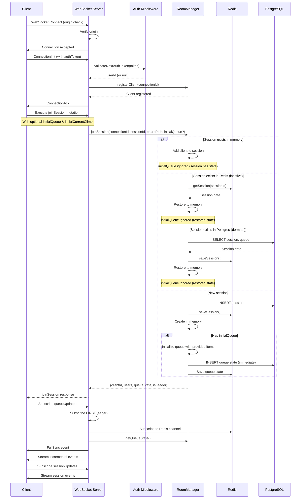

### Key Points

1. **Origin Validation**: WebSocket connections are validated against allowed origins
2. **Authentication**: Optional auth token passed in `connectionParams`
3. **Eager Subscription**: Queue subscription starts BEFORE fetching state to prevent race conditions
4. **Session Restoration**: Sessions can be restored from Redis (hot) or PostgreSQL (cold)
5. **Initial Queue Seeding**: When creating a new session, clients can provide `initialQueue` and `initialCurrentClimb` to seed the session with an existing local queue (e.g., when starting party mode with climbs already queued)

### Initial Queue Seeding

When a user starts party mode while they already have climbs in their local queue, the client sends the existing queue along with the `joinSession` mutation. This ensures users don't lose their queued climbs when transitioning to party mode.

**GraphQL Mutation Parameters:**
```graphql
mutation JoinSession(
  $sessionId: ID!
  $boardPath: String!
  $username: String
  $avatarUrl: String
  $initialQueue: [ClimbQueueItemInput!]    # Optional: existing queue items
  $initialCurrentClimb: ClimbQueueItemInput # Optional: current climb
  $sessionName: String                      # Optional: display name for the session
) {
  joinSession(
    sessionId: $sessionId
    boardPath: $boardPath
    username: $username
    avatarUrl: $avatarUrl
    initialQueue: $initialQueue
    initialCurrentClimb: $initialCurrentClimb
    sessionName: $sessionName
  ) { ... }
}
```

**Behavior:**
- `initialQueue`, `initialCurrentClimb`, and `sessionName` are **only applied when creating a new session**
- If joining an existing session (active, inactive, or dormant), these values are ignored and the existing session state is used
- The queue is persisted immediately to Postgres (not debounced) to ensure durability for new sessions
- All users who join after the initial seed will receive the seeded queue state

**Client Flow (PersistentSessionContext):**
1. User calls `startSession()` which generates a new session ID
2. Client stores current queue in `pendingInitialQueue` via `setInitialQueueForSession()`
3. On WebSocket connection, the `joinSession` mutation includes the initial queue data
4. Server initializes the new session with the provided queue items
5. Client clears `pendingInitialQueue` after successful join

### Session Path Continuity

The WebSocket connection should remain stable when users navigate within the same board configuration. This is controlled by the **base board path** concept.

**URL Structure:**
```
/{board}/{layout}/{size}/{sets}/{angle}/{view}/{climb}
  │       │        │      │      │       │       │
  └───────┴────────┴──────┴──────┴───────┴───────┴──── Dynamic segments
  │       │        │      │      │
  └───────┴────────┴──────┴──────┴──────────────────── Base board path (session identity)
```

**What triggers session reconnection:**
| Change Type | Reconnects? | Reason |
|-------------|-------------|--------|
| Different board (kilter vs tension) | ✅ Yes | Different physical board |
| Different layout | ✅ Yes | Different hold arrangement |
| Different size | ✅ Yes | Different board dimensions |
| Different sets | ✅ Yes | Different hold selection |
| Different angle | ❌ No | Board angle is adjustable during session |
| Different view (/list, /play, /create) | ❌ No | Just navigation state |
| Different climb (in /play view) | ❌ No | Just viewing different climb |

**Implementation:**
The `getBaseBoardPath()` utility in `url-utils.ts` extracts the stable board configuration path by stripping:
- `/play/[climb_uuid]` - climb being viewed
- `/view/[climb_slug]` - climb detail view
- `/list`, `/create` - view type
- `/{angle}` - board angle (numeric segment at end)

This ensures `BoardSessionBridge` only calls `activateSession()` when the actual board configuration changes, not when users swipe between climbs or adjust the board angle.

---

## Session Management

### Session Lifecycle States

```
                    ┌─────────────────────────────────────┐
                    │              Created                  │
                    │  - Optional: goal, color, boardIds   │
                    │  - Optional: isPermanent flag        │
                    │  - startedAt set on creation         │
                    └──────────────┬────────────────────────┘
                                   │ First user joins
                                   ▼
    ┌──────────────────────────────────────────────┐
    │                   ACTIVE                      │
    │  - Users connected                            │
    │  - Real-time sync enabled                     │
    │  - Redis cache hot                            │
    │  - In-memory session state                    │
    └──────┬───────────────────────┬───────────────┘
           │ Last user leaves      │ Leader calls endSession
           ▼                       ▼
    ┌────────────────────┐   ┌──────────────────────────────┐
    │  GRACE PERIOD (60s)│   │     ENDED (explicit)          │
    │  - No connected    │   │  - endedAt set                │
    │    users           │   │  - Summary generated           │
    │  - In-memory state │   │  - SessionEnded event sent     │
    │    RETAINED        │   │  - Removed from Redis          │
    │  - Redis: inactive │   │  - Postgres record kept        │
    │  - Postgres:       │   └──────────────────────────────┘
    │    'inactive'      │
    └────────┬──────┬────┘
             │      │ 60s expires
             │      ▼
             │   ┌─────────────────────────────┐
             │   │          INACTIVE            │
             │   │  - In-memory state deleted   │
             │   │  - Redis cache retained (4h) │
             │   │  - Restoration needed on     │
             │   │    next join (lock + fetch)   │
             │   └──────────┬──────────────────┘
             │              │ TTL expires OR auto-end
             │              ▼
             │   ┌──────────────────────────────┐
             │   │      ENDED (auto/TTL)         │
             │   │  - endedAt set                │
             │   │  - Removed from Redis         │
             │   │  - Postgres record kept       │
             │   │  - Cannot be rejoined         │
             │   └──────────────────────────────┘
             │
             │ User rejoins within grace
             ▼
    ┌────────────────────┐
    │  Back to ACTIVE    │
    │  (no restoration   │
    │   needed)          │
    └────────────────────┘
```

**Grace Period:** When the last user disconnects, the session enters a 60-second grace period where in-memory state is preserved. If a client reconnects within this window (common during network flaps or page refreshes), the session is instantly available without the expensive lock + Redis/Postgres restoration cycle. The grace period duration is controlled by `SESSION_GRACE_PERIOD_MS` in `RoomManager`.

### Session Properties

Sessions support the following configurable properties set at creation time:

| Property | Type | Description |
|----------|------|-------------|
| `goal` | `String?` | Free-text session goal (max 500 chars), displayed in the session header |
| `color` | `String?` | Hex color code for multi-session display (e.g., `#FF5722`) |
| `isPermanent` | `Boolean` | Exempt from auto-end cleanup (for gym kiosk sessions) |
| `isPublic` | `Boolean` | Whether the session appears in discovery (default: true) |
| `boardIds` | `[Int]?` | Multi-board support — links session to specific boards within a gym |

### Session Ending and Summaries

Sessions can end in three ways:

1. **Explicit end** — Leader or creator calls `endSession` mutation
2. **Auto-end** — Background job ends inactive, non-permanent sessions after 30 minutes (configurable via `SESSION_AUTO_END_MINUTES` env var)
3. **TTL expiry** — Redis cache expires after 4 hours of inactivity

When a session ends explicitly via `endSession`:
- `endedAt` timestamp is recorded in Postgres
- A `SessionEnded` event is broadcast to all connected clients
- A `SessionSummary` is generated and returned to the caller

**Session Summary** includes:
- Total sends and attempts across all participants
- Grade distribution (sends grouped by difficulty grade)
- Hardest climb sent (with climb name and grade)
- Per-participant stats (sends, attempts, display name, avatar)
- Session duration (calculated from `startedAt` to `endedAt`)
- Session goal (if set)

The frontend displays the summary in a dialog when the session ends, and optionally as a feed item in the activity feed.

### Auto-End Cleanup

A periodic background job runs every 5 minutes on the backend server to automatically end stale sessions:

- Targets sessions with status `inactive` that have not had activity for `SESSION_AUTO_END_MINUTES` (default: 30)
- Skips sessions with `isPermanent = true` (gym kiosk sessions)
- Processes up to 50 sessions per cycle to avoid overload
- Failures for individual sessions are logged but don't block other sessions

### Multi-Board Sessions

Sessions can be linked to multiple boards within the same gym via the `sessionBoards` junction table. This is validated at creation time:
- All `boardIds` must exist in the `userBoards` table
- All boards must belong to the same gym (different gyms are rejected)

### Leader Election

Leader election uses Redis-backed atomic operations for consistency across instances:

**Single Instance Mode:**
- First client to join becomes leader
- On leader disconnect, earliest connected client is elected

**Multi-Instance Mode (Distributed):**
- Uses Lua scripts for atomic leader election
- Leader stored in Redis: `boardsesh:session:{id}:leader`
- Consistent across all backend instances

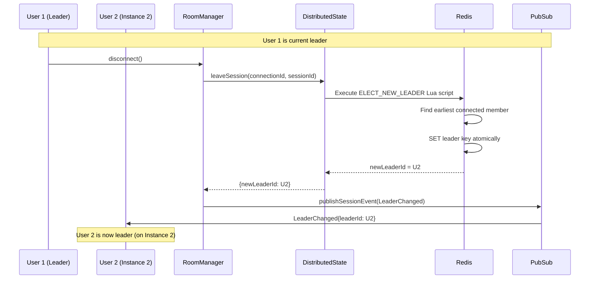

**Lua Script Atomicity:**
```lua
-- ELECT_NEW_LEADER_SCRIPT
-- Gets all session members, filters out leaving connection
-- Sorts by connectedAt, picks earliest
-- Atomically sets new leader
```

---

## Queue State Synchronization

### Event Types

| Event | Description | Fields |
|-------|-------------|--------|
| `FullSync` | Complete state snapshot | `sequence`, `state` (queue + currentClimb) |
| `QueueItemAdded` | Item added to queue | `sequence`, `item`, `position` |
| `QueueItemRemoved` | Item removed from queue | `sequence`, `uuid` |
| `QueueReordered` | Item moved in queue | `sequence`, `uuid`, `oldIndex`, `newIndex` |
| `CurrentClimbChanged` | Active climb changed | `sequence`, `item`, `clientId`, `correlationId` |
| `ClimbMirrored` | Mirror state toggled | `sequence`, `mirrored` |

### Optimistic Updates with Correlation IDs

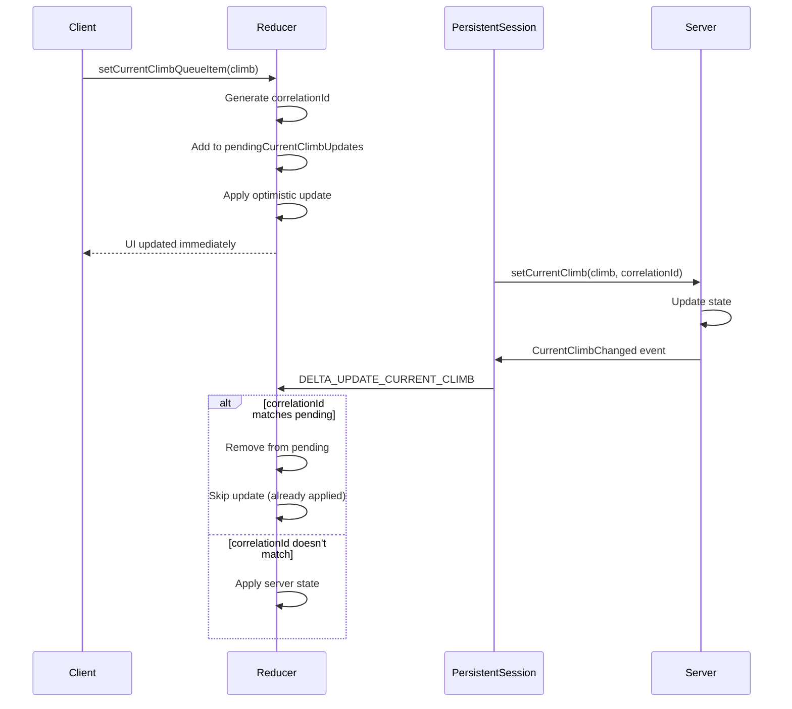

### Sequence Gap Detection

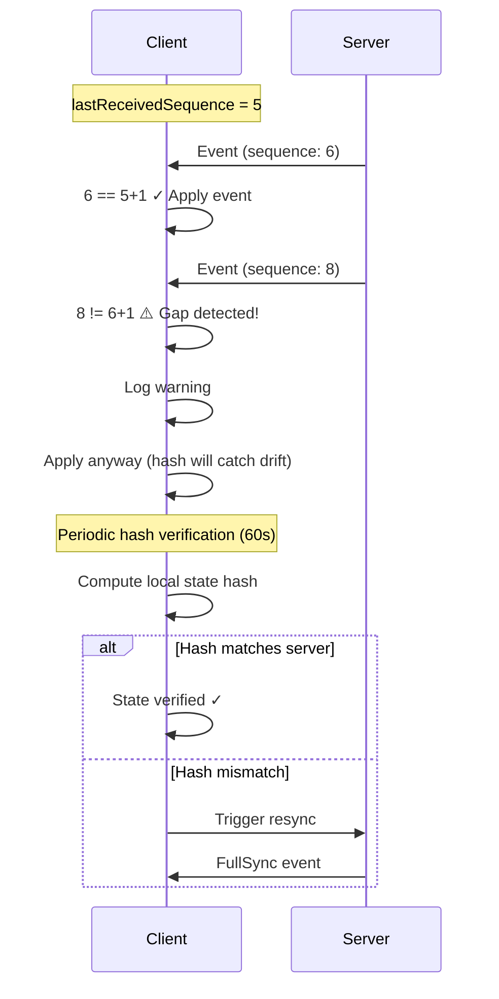

---

## Multi-Instance Support

The backend supports horizontal scaling with multiple instances behind a load balancer. **No sticky sessions are required** - any instance can handle any client.

### Architecture

```
┌─────────────────────────────────────────────────────────────────┐
│                        Load Balancer                             │
│              (No sticky sessions required)                       │
└─────────────────────────────────────────────────────────────────┘
           │                    │                    │
    ┌──────▼───────┐    ┌──────▼───────┐    ┌──────▼───────┐
    │  Instance A  │    │  Instance B  │    │  Instance C  │
    │              │    │              │    │              │
    │ DistState ───┼────┼──────────────┼────┼─── Redis ◄──┤
    │  Manager     │    │              │    │              │
    └──────────────┘    └──────────────┘    └──────────────┘
```

### DistributedStateManager

The `DistributedStateManager` enables true horizontal scaling:

| Feature | Description |
|---------|-------------|
| Connection Tracking | All connections visible across instances via Redis |
| Session Membership | Aggregated user list from all instances |
| Leader Election | Atomic Lua scripts ensure consistent leader |
| Instance Heartbeat | 30s heartbeat detects dead instances |
| Graceful Cleanup | Connections cleaned up on instance shutdown |

### Redis Pub/Sub for Cross-Instance Events

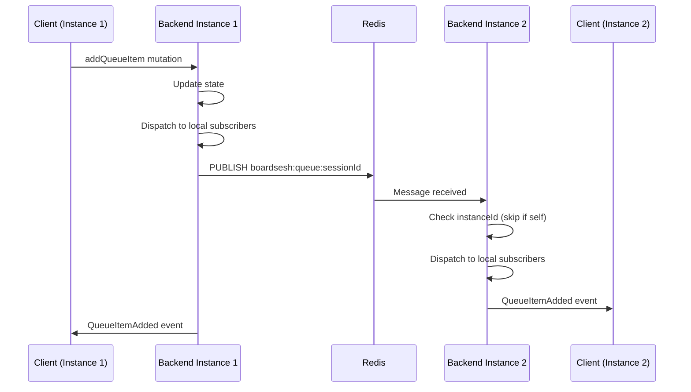

### Cross-Instance Session Membership Validation

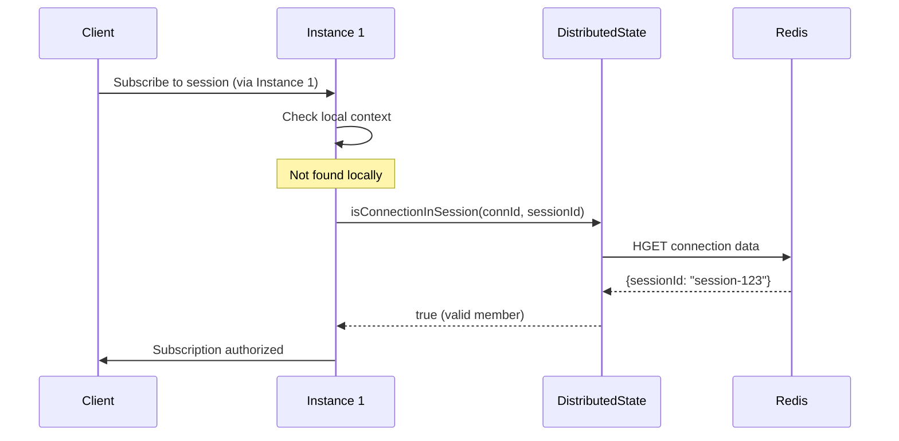

### Channel Naming Convention

- Queue events: `boardsesh:queue:{sessionId}`
- Session events: `boardsesh:session:{sessionId}`
- Notification events: `boardsesh:notifications:{userId}` (per-user, authenticated)
- Comment live updates: `boardsesh:comments:{entityType}:{entityId}` (per-entity, public)

### Event Buffer for Delta Sync

Events are buffered in Redis for reconnection recovery:

```
boardsesh:session:{sessionId}:events
├── Most recent event (index 0)
├── ...
└── Oldest event (max 100 events, 5 min TTL)
```

---

## Failure States and Recovery

### 1. Client Disconnection

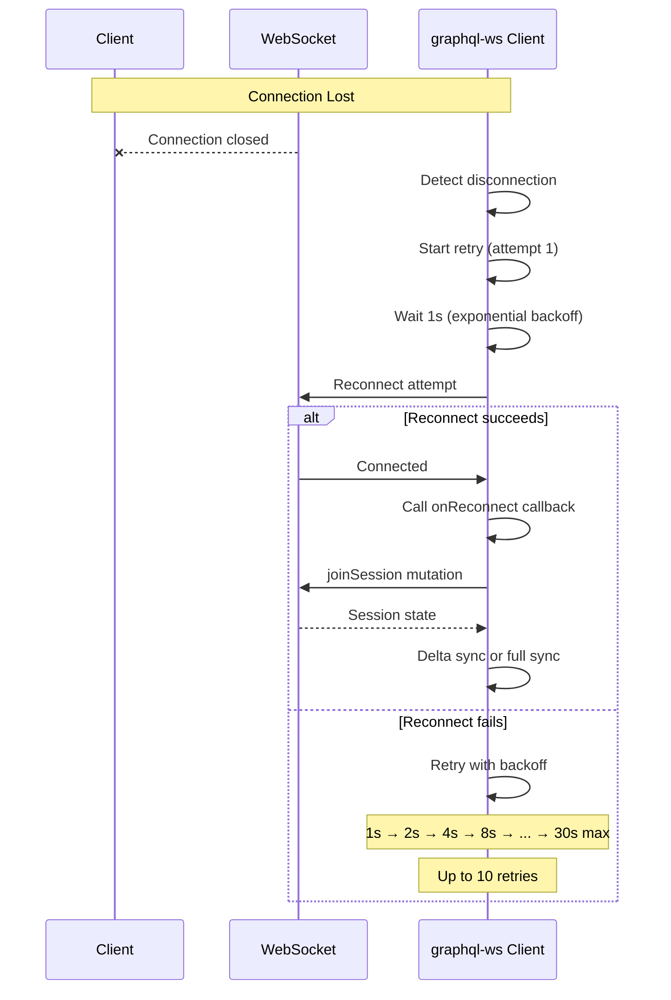

**Recovery mechanism:**
- Exponential backoff: 1s, 2s, 4s, 8s, 16s, 30s (max)
- Up to 10 retry attempts
- On reconnection: re-join session and sync state
- Delta sync attempted if gap ≤ 100 events
- Falls back to full sync if gap too large

### 2. Redis Connection Failure

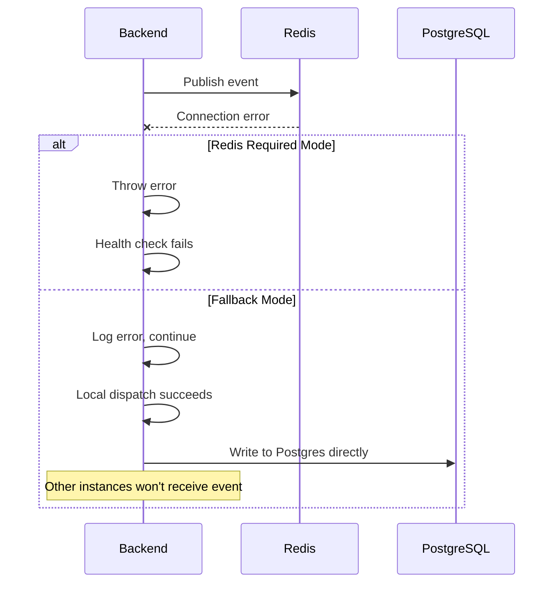

**Key behavior:**
- If `REDIS_URL` is configured, Redis is **required** (fail-closed)
- Without Redis config: local-only mode (single instance)
- Publish failures logged but don't block local dispatch
- Health endpoint reports Redis status

### 3. PostgreSQL Write Failure

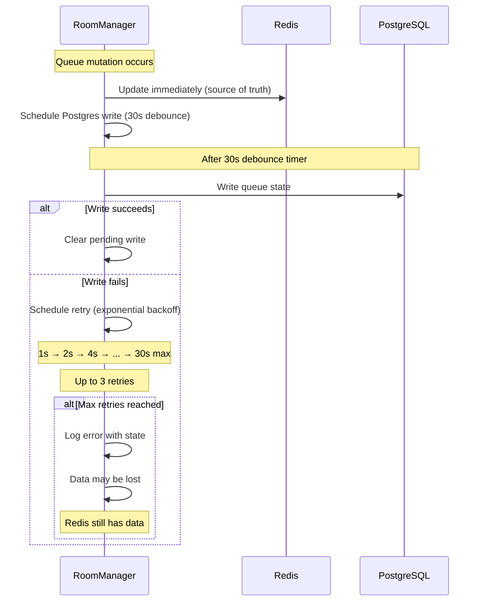

**Mitigation:**
- Redis is the real-time source of truth
- Postgres writes are debounced (30s) and retried
- Graceful shutdown flushes all pending writes
- Session can be recovered from Redis (4h TTL)

### 4. Session Restoration Race Condition

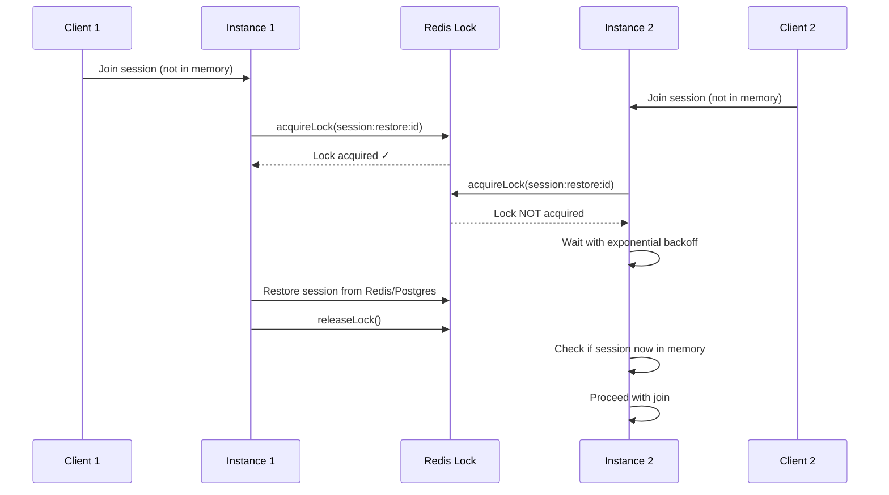

**Lock mechanism:**
- Redis-based distributed lock (10s TTL)
- Lua script ensures only owner can release
- Backoff waiting: 50ms → 100ms → 200ms → ... (5 attempts)

### 5. State Hash Mismatch (Drift Detection)

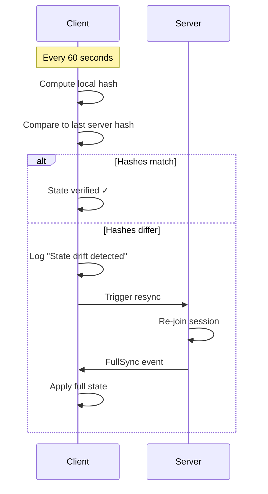

**Additional checks:**
- Current climb must exist in queue
- Sequence numbers must increment by 1
- Hash updated after each delta event

### 6. Queue Item Corruption Detection

The client detects and recovers from corrupted queue items (null/undefined entries) that may occur due to server bugs, network issues, or state corruption.

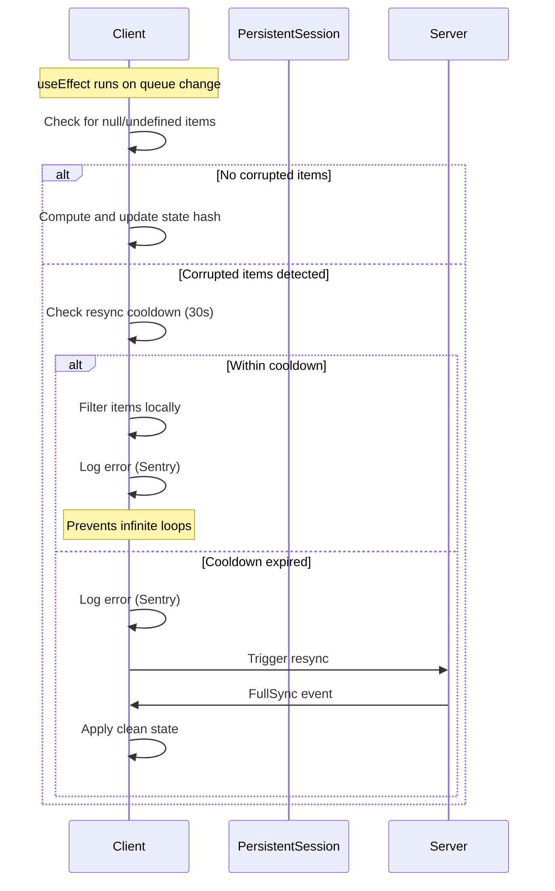

**Corruption sources:**
- Server sends malformed queue data
- State corruption during delta sync
- Race conditions in event handling

**Detection points:**
1. **FullSync handler**: Filters null items when receiving initial/full state
2. **QueueItemAdded handler**: Skips events with null items
3. **State hash effect**: Detects corruption in current queue state

**Resync cooldown:**
- 30 second cooldown between corruption-triggered resyncs
- Prevents infinite loop if server keeps returning corrupted data
- During cooldown: filter corrupted items locally instead of resyncing
- All corruption events logged at `console.error` level for Sentry visibility

**Implementation:**
- `computeQueueStateHash()` defensively filters null/undefined items
- `isFilteringCorruptedItemsRef` prevents useEffect re-trigger loops
- `lastCorruptionResyncRef` tracks cooldown timing

### 7. Subscription Error / Complete

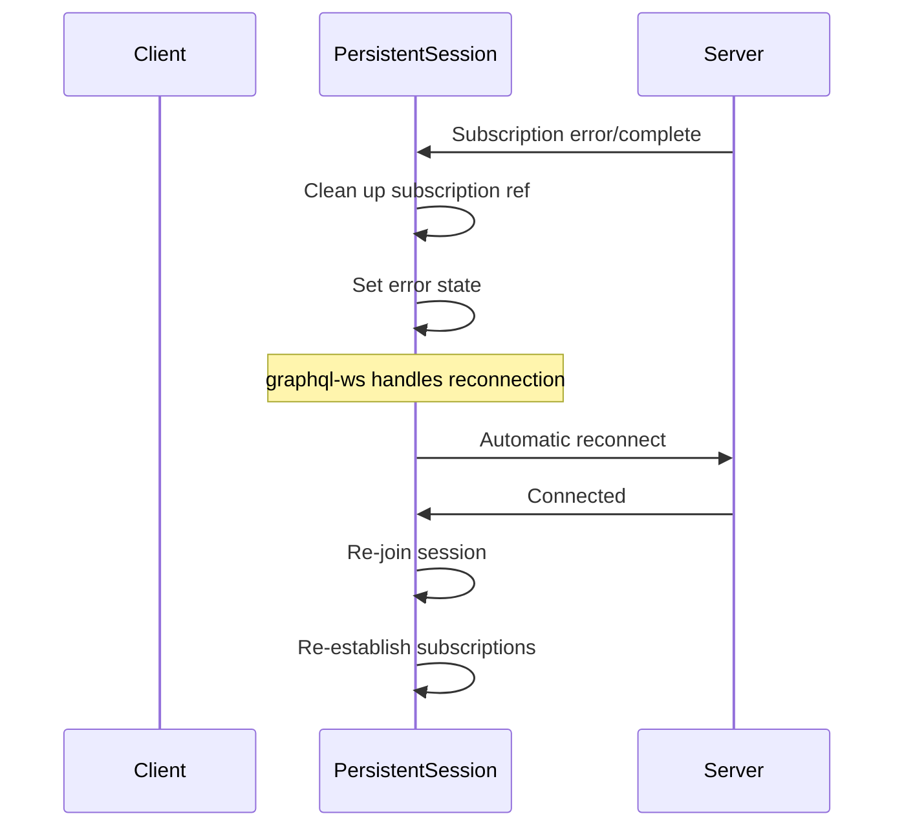

---

## Data Persistence Strategy

### Hybrid Storage Architecture

```
┌─────────────────────────────────────────────────────────────────┐
│                         Write Path                               │
├─────────────────────────────────────────────────────────────────┤
│                                                                  │
│   Queue Mutation ──────► Redis (immediate)                       │
│         │                                                        │
│         └──────────────► Postgres (30s debounced)                │
│                                                                  │
└─────────────────────────────────────────────────────────────────┘

┌─────────────────────────────────────────────────────────────────┐
│                         Read Path                                │
├─────────────────────────────────────────────────────────────────┤
│                                                                  │
│   Get State ──► Redis (hot cache) ──► Postgres (cold storage)   │
│                      │                       │                   │
│                      ▼                       ▼                   │
│                 Active sessions         Dormant sessions         │
│                 (< 4 hours)             (> 4 hours)              │
│                                                                  │
└─────────────────────────────────────────────────────────────────┘
```

### Postgres-Only Fallback (Single Instance Mode)

When Redis is unavailable, RoomManager falls back to **Postgres-only mode**:

- Queue mutations write **directly to Postgres** (no debouncing, since there's no Redis to serve as a fast read layer)
- Session restoration from Redis is skipped; only Postgres restoration is available
- Distributed state (cross-instance leader election, connection tracking) is disabled
- This mode only supports a single backend instance (no horizontal scaling)

### Session State Tiers

| Tier | Storage | TTL | Use Case |
|------|---------|-----|----------|
| **Hot** | In-Memory + Redis | 4 hours | Active sessions with connected users |
| **Warm** | Redis only | 4 hours | Recently inactive (users left) |
| **Cold** | PostgreSQL | Indefinite | Historical sessions, dormant restoration |

### Key Redis Data Structures

**Session State (RedisSessionStore):**
```
boardsesh:session:{id}              # Hash - session data (queue, version, etc.)
boardsesh:session:{id}:users        # Hash - connected users (legacy)
boardsesh:session:{id}:events       # List - event buffer (delta sync)
boardsesh:session:active            # Set - active session IDs
boardsesh:session:recent            # Sorted Set - recent sessions (by time)
boardsesh:lock:session:restore:{id} # String - distributed lock (10s TTL)
```

**Distributed State (DistributedStateManager):**
```
boardsesh:conn:{connectionId}       # Hash - connection data (instanceId, sessionId, username, etc.)
boardsesh:session:{id}:members      # Set - connection IDs in session (cross-instance)
boardsesh:session:{id}:leader       # String - leader connection ID
boardsesh:instance:{id}:conns       # Set - connections owned by instance
boardsesh:instance:{id}:heartbeat   # String - instance heartbeat timestamp (60s TTL)
```

**Pub/Sub Channels:**
```
boardsesh:queue:{sessionId}         # Queue events (add, remove, reorder, etc.)
boardsesh:session:{sessionId}       # Session events (join, leave, leader change)
```

### Graceful Shutdown

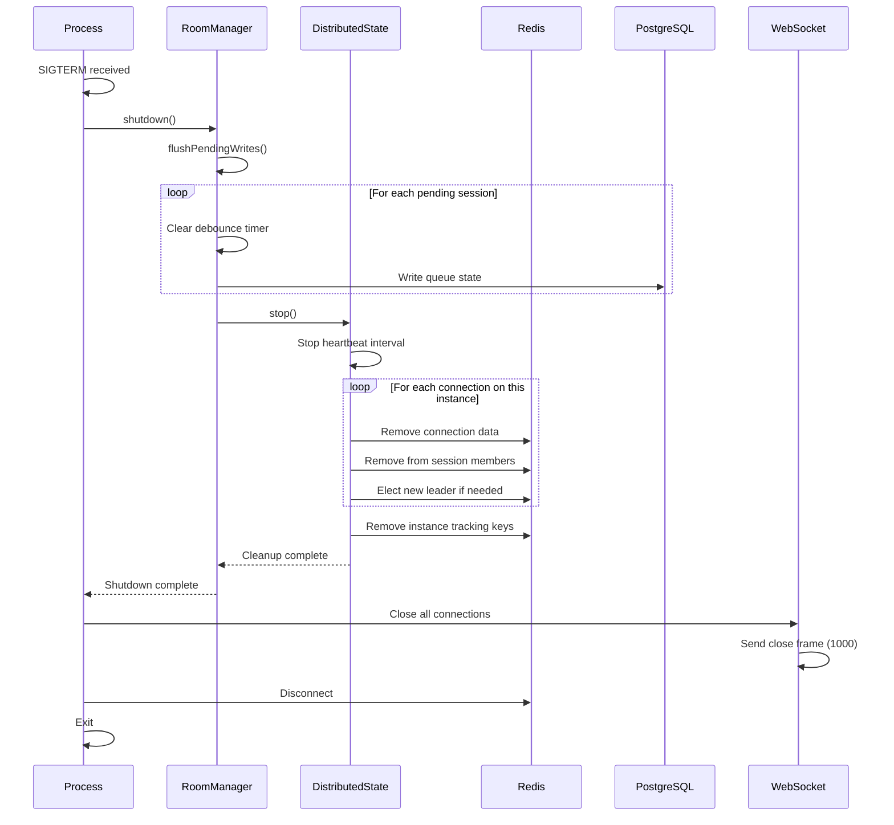

### Dead Instance Detection and TTL Cleanup

When an instance crashes or terminates without graceful shutdown, the system relies on TTL-based cleanup:

**1. Instance Heartbeat Expiry (60s TTL)**

Each instance updates its heartbeat every 30 seconds:
```
boardsesh:instance:{id}:heartbeat = timestamp (60s TTL)
```

When an instance dies unexpectedly:
- The heartbeat key expires after 60 seconds
- Redis automatically removes the heartbeat key

**2. Connection Data Expiry (1 hour TTL)**

Connection data has its own TTL:
```
boardsesh:conn:{connectionId} = {...} (1 hour TTL)
```

Connections from dead instances:
- Continue to exist until their 1-hour TTL expires
- Are refreshed on client activity (extends TTL)
- Eventually expire if no activity

**3. Session Member Sets (4 hour TTL)**

Session member sets track all connection IDs:
```
boardsesh:session:{id}:members = Set of connectionIds (4 hour TTL)
```

**Limitation: No Active Cleanup for Dead Instances**

Currently, there is no background job that actively scans for dead instances and cleans up their orphaned connections. This means:

- Session member sets may temporarily contain connection IDs from dead instances
- `getSessionMembers()` may return connections that no longer exist (gracefully handled by filtering out missing connection data)
- Leader election may initially select a connection from a dead instance (but will re-elect on next leader action)
- Connection data remains until TTL expires naturally

**Implications for Clients**

- Clients should handle the case where a session "member" is no longer reachable
- Leader changes may occur when the elected leader from a dead instance is detected as unresponsive
- User lists may temporarily show stale entries that get filtered out on refresh

**Future Improvement**

A background cleanup job could periodically:
1. Scan for instances with expired heartbeats
2. Remove their orphaned connections from session member sets
3. Trigger leader re-election if the current leader's instance is dead

This would reduce the window of stale data but is not currently implemented.

---

## Controller Events (ESP32 Integration)

The backend supports ESP32 controllers that bridge between official Kilter/Tension apps and BoardSesh sessions. Controllers receive LED updates and can send detected climbs back to the session.

### Authentication

Controllers authenticate using API keys passed in the WebSocket connection params (not in GraphQL variables):

```javascript
// graphql-ws protocol connection_init
{
  "type": "connection_init",
  "payload": {
    "controllerApiKey": "your-64-char-hex-key"
  }
}
```

The backend extracts this from `connectionParams.controllerApiKey` during the `onConnect` hook and stores `controllerId` and `controllerApiKey` in the connection context.

### Authorization Flow

1. **User Registration** (Web UI)
   - User visits Settings > ESP32 Controllers
   - Clicks "Add Controller" and configures board type, layout, size, sets
   - Receives a 64-character hex API key (shown once, must save it)

2. **Session Authorization** (Automatic)
   - When user calls `joinSession` mutation (authenticated)
   - Backend auto-authorizes all user's controllers for that session
   - Sets `authorizedSessionId` column in database

3. **Controller Connection** (ESP32)
   - ESP32 connects with API key in `connection_init` payload
   - Backend validates key and populates context with controller info

4. **Subscription Authorization**
   - Controller subscribes to `controllerEvents(sessionId)`
   - Backend verifies controller is authorized for that session
   - Throws error if not: "Controller not authorized for session"

5. **Mutation Authorization**
   - Controller calls `setClimbFromLedPositions(sessionId, frames)`
   - Backend verifies session authorization before processing

### Controller Subscription

```graphql
subscription ControllerEvents($sessionId: ID!) {
  controllerEvents(sessionId: $sessionId) {
    ... on LedUpdate {
      commands { position r g b }
      climbUuid
      climbName
      climbGrade
      boardPath
      angle
    }
    ... on ControllerPing {
      timestamp
    }
  }
}
```

### Events

| Event | Description |
|-------|-------------|
| `LedUpdate` | LED commands for current climb (RGB values and positions) |
| `ControllerQueueSync` | Full queue state sync (sent on connection and queue changes) |
| `ControllerPing` | Keep-alive ping (not currently implemented) |

### LedUpdate Fields

| Field | Type | Description |
|-------|------|-------------|
| `commands` | Array | LED positions with RGB values |
| `queueItemUuid` | String | UUID of the queue item (for navigation) |
| `climbUuid` | String | Unique identifier for the climb |
| `climbName` | String | Display name of the climb |
| `climbGrade` | String | The climb difficulty/grade (e.g., "V5", "6a/V3") |
| `gradeColor` | String | Hex color for the grade (e.g., "#00FF00") |
| `boardPath` | String | Board configuration path for context-aware operations (e.g., "kilter/1/12/1,2,3/40") |
| `angle` | Int | Board angle in degrees |
| `clientId` | String | Identifier of client that initiated the change (used by ESP32 to decide whether to disconnect BLE client - if clientId matches ESP32's MAC, it was self-initiated via BLE) |
| `navigation` | Object | Navigation context with previousClimbs, nextClimb, currentIndex, totalCount |

### ControllerQueueSync Fields

| Field | Type | Description |
|-------|------|-------------|
| `queue` | Array | Array of queue items with uuid, climbUuid, name, grade, gradeColor |
| `currentIndex` | Int | Index of the current climb in the queue (-1 if none) |

### LED Color Mapping

| Hold State | RGB Value |
|------------|-----------|
| STARTING | (0, 255, 0) Green |
| FINISH | (255, 0, 255) Magenta |
| HAND | (0, 255, 255) Cyan |
| FOOT | (255, 170, 0) Orange |

### Controller Mutations

```graphql
# Send detected climb from Bluetooth
mutation SetClimbFromLeds($sessionId: ID!, $frames: String) {
  setClimbFromLedPositions(sessionId: $sessionId, frames: $frames) {
    matched
    climbUuid
    climbName
  }
}

# Navigate queue via hardware buttons (previous/next)
# queueItemUuid is preferred for direct navigation (most reliable)
# direction is used as fallback when queueItemUuid not found
mutation NavigateQueue($sessionId: ID!, $direction: String!, $queueItemUuid: String) {
  navigateQueue(sessionId: $sessionId, direction: $direction, queueItemUuid: $queueItemUuid) {
    uuid
    climb {
      name
      difficulty
    }
  }
}

# Heartbeat to update lastSeenAt
mutation Heartbeat($sessionId: ID!) {
  controllerHeartbeat(sessionId: $sessionId)
}
```

### Queue Navigation

The `navigateQueue` mutation allows ESP32 controllers to browse the queue via hardware buttons:

| Parameter | Type | Description |
|-----------|------|-------------|
| `sessionId` | ID! | Session to navigate within |
| `direction` | String! | "next" or "previous" (fallback if queueItemUuid not found) |
| `queueItemUuid` | String | Direct navigation to specific queue item (preferred) |

**Navigation Flow:**
1. ESP32 maintains local queue state from `ControllerQueueSync` events
2. On button press, ESP32 calculates the target item locally (optimistic update)
3. ESP32 sends `navigateQueue` with the target `queueItemUuid`
4. Backend updates current climb and broadcasts `CurrentClimbChanged`
5. ESP32 receives `LedUpdate` with new climb data

**Debounce Behavior:**
- Navigation mutations are debounced with a 100ms delay to prevent WebSocket disconnection from rapid button presses
- UI updates immediately (optimistic), but only ONE mutation is sent after 100ms of button inactivity
- Example: Pressing "next" 10 times quickly results in 10 immediate display updates but only 1 mutation (to the final position)
- During rapid navigation, incoming `LedUpdate` events skip queue index sync to preserve optimistic state
- Only one mutation can be in-flight at a time; new mutations wait for the previous to complete

### Manual Authorization

If auto-authorization doesn't apply (e.g., controller owner is not in session), use:

```graphql
mutation AuthorizeController($controllerId: ID!, $sessionId: ID!) {
  authorizeControllerForSession(controllerId: $controllerId, sessionId: $sessionId)
}
```

Requires user authentication and controller ownership.

---

## Configuration

### Environment Variables

| Variable | Description | Default |
|----------|-------------|---------|
| `REDIS_URL` | Redis connection string | None (local-only mode) |
| `PORT` | HTTP/WS server port | 8080 |
| `BOARDSESH_URL` | Allowed CORS origin | https://boardsesh.com |
| `SESSION_AUTO_END_MINUTES` | Inactive session auto-end threshold | 30 |

### Timeouts and Limits

| Setting | Value | Purpose |
|---------|-------|---------|
| Retry attempts | 10 | WebSocket reconnection |
| Max retry delay | 30s | Exponential backoff cap |
| Keep-alive interval | 10s | Connection health check |
| Mutation timeout | 30s | Prevent hanging mutations |
| Redis TTL | 4 hours | Session cache expiry |
| Postgres debounce | 30s | Batch writes |
| Event buffer size | 100 | Delta sync limit |
| Event buffer TTL | 5 min | Old events cleanup |
| Hash verification | 60s | State drift detection |
| Subscription queue | 1000 | Max pending events |
| Connection TTL | 1 hour | Distributed connection expiry |
| Instance heartbeat | 30s | Heartbeat update interval |
| Instance heartbeat TTL | 60s | Dead instance detection |
| Session members TTL | 4 hours | Matches session TTL |
| Session grace period | 60s | In-memory retention after last disconnect |
| Session auto-end | 30 min | Auto-end inactive non-permanent sessions |
| Auto-end check interval | 5 min | How often the auto-end job runs |

### Error Handling and Filtering

The WebSocket client includes error handling for common connection issues:

**Origin/CORS Errors**

Some browsers (especially Safari/WebKit on iOS) throw cryptic "invalid origin" errors during WebSocket handshake. These can be caused by:
- Browser privacy/tracking protection blocking WebSocket connections
- Network issues during the handshake phase
- Server CORS configuration mismatches

The client:
1. Wraps WebSocket with early error handlers (`graphql-client.ts`)
2. Detects origin-related errors using patterns in `websocket-errors.ts`
3. Skips retry attempts for origin errors (they won't resolve without configuration changes)
4. Filters these errors from Sentry to reduce noise (`instrumentation-client.ts`)

**Filtered Error Patterns**

The following patterns are filtered from Sentry (defined in `packages/web/app/lib/websocket-errors.ts`):
- `invalid origin` - Browser origin validation error
- `origin not allowed` - Server CORS rejection
- `websocket is already in closing` - Normal lifecycle state
- `graphql subscription` - Expected subscription lifecycle events

Generic errors like "failed to fetch" or "connection closed" are NOT filtered, as they may indicate legitimate issues that need investigation.

---

## Related Files

### Backend

- `packages/backend/src/websocket/setup.ts` - WebSocket server configuration
- `packages/backend/src/pubsub/index.ts` - Event pub/sub system
- `packages/backend/src/pubsub/redis-adapter.ts` - Redis pub/sub adapter
- `packages/backend/src/services/room-manager.ts` - Session & queue management
- `packages/backend/src/services/redis-session-store.ts` - Redis session persistence
- `packages/backend/src/services/distributed-state.ts` - Multi-instance state management
- `packages/backend/src/graphql/resolvers/queue/` - Queue mutations & subscriptions
- `packages/backend/src/graphql/resolvers/sessions/` - Session mutations & subscriptions
- `packages/backend/src/graphql/resolvers/shared/helpers.ts` - Cross-instance auth validation

### Frontend

- `packages/web/app/components/graphql-queue/graphql-client.ts` - WebSocket client with error handling
- `packages/web/app/components/graphql-queue/use-queue-session.ts` - Session hook
- `packages/web/app/components/persistent-session/persistent-session-context.tsx` - Root-level session management
- `packages/web/app/components/graphql-queue/QueueContext.tsx` - Queue state context
- `packages/web/app/lib/websocket-errors.ts` - WebSocket error detection utilities
- `packages/web/instrumentation-client.ts` - Sentry error filtering

### Shared

- `packages/shared-schema/src/schema.ts` - GraphQL schema definition
- `packages/shared-schema/src/types.ts` - TypeScript types
